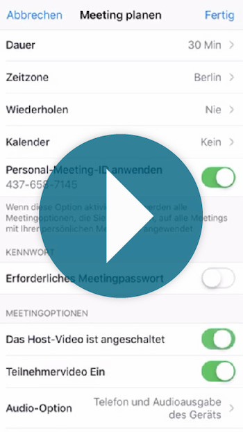

## Willkommen beim Cybertraining

Auf dieser Seite wollen wir Hilfestellungen geben, wie man in Vereinen Cybertraining initialisieren kann, so dass das Vereinsleben auch bei Social Distancing weitergehen kann. 

Wir erklären auf dieser Seite wie du als Trainer dein Team zum Cybertraining bringst.
Wir haben ein paar Videos damit du ihr die Technik schnell hinbekommt.  
Und wir haben als Vorlagen für deine Mails oder Gruppennachrichten eine paar ```Textbeispiele``` 
Zur Motivation hier aber erstmal ein kleines [Video](https://youtu.be/qiL5HIlWSo4) von einem Trainer der es probiert hat:

[](https://youtu.be/qiL5HIlWSo4)

Parallel eignen sich auch [Challenges](https://phimichel.github.io/ZusammenAlleinChallenges/index.html), um einen ersten Einstieg in Social Distance Training zu bekommen.


### Was ist Cybertraining
Beim Cybertraining treffen sich Team und Trainer via Videoübertragung mittels einer App. Man kann sich sehen, reden und gemeinsam Sport treiben oder einfach nur Spaß haben.

### Für wen eignet sich Cybertraining
Es gibt Sportarten, bei denen sich Cybertraining mehr eignet wie z.b. Karate und welche, wo es vielleicht nicht ganz so gut geeinget ist, wie Synchronschwimmen.
Ob dein Sport sich eignet, musst du selbst entscheiden. Vielleicht kannst du ja mit deinem Team zumindest Kraft und Ausdauerübungen gemeinsam machen, oder ihr trefft euch einfach mal so virtuell.

### Meetingsoftware Zoom herunterladen und Nutzer für Trainer registrieren
Wir haben ein kleines [Video](https://youtu.be/H-uyyE9ly6E) für euch gedreht, das sollte alles erklären.

[](https://youtu.be/H-uyyE9ly6E)
  

### Cybertraining ankündigen
```
Wer mal wieder Lust auf Sport hat, kann heute Cybertraining mit mir ausprobieren.  
Wir bleiben zu Hause, sehen uns via App und machen gemeinsam Übungen.  
Ihr braucht:  
Ein Handy oder Tablet, WLAN, Sportsachen, was zu Trinken, euer Sportgerät.  
Sucht euch einen Platz nah genug am WLAN, wo ihr das Handy/Tablet sicher abstellen könnt (Handyhalter?).   
Ihr solltet das Display sehen können und von der Kamera auch aufgenommen werden können.  
Ihr solltet genug Platz haben, um nichts kaputt zu machen.  
Ladet auf euer Tablet oder Handy die App Zoom:  
Apple: https://apps.apple.com/de/app/zoom-cloud-meetings/id546505307  
Android: https://play.google.com/store/apps/details?id=us.zoom.videomeetings&hl=de  
Ich schick dann kurz vorher einen Link, auf den ihr dann einfach klickt.  
Ihr werdet dann automatisch in die App geleitet und müsst noch ein paar Zugriffe auf Mikro usw. zulassen.   
Und schon geht's los mit dem Cybertraining.
``` 

### Erklärvideo für Teilnehmer
[](https://youtu.be/QvUTj2ogdHU)
```
Für alle denen das zuviel Text war, hier noch ein kurzes Video https://youtu.be/QvUTj2ogdHU  
Gleich schicke ich euch den Link zum Meeting.  
Damit könnt ihr schonmal die Technik ausprobieren.   
Wundert euch nicht wenn ihr dort erstmal noch keinen trefft.  
Spätestens zur vereinbarten Zeit bin ich dann auch drin :-).
Es ist hilfreich, wenn ihr euch stumm schaltet, wenn ihr nichts sagt.
```


### Meeting erstellen und Link versenden
Wir haben ein kleines [Video](https://youtu.be/ZwTNwkgXiKg) für euch gedreht, das sollte alles erklären.

[](https://youtu.be/ZwTNwkgXiKg)


### Und was mache ich jetzt im Cybertraining mit meinem Team?
Das weißt du als Trainer bestimmt viel besser als wir. Einen Tipp können wir dir geben: Bereite dich ein wenig vor, die Technik wird dich beim erstenmal ablenken und da ist es gut wenn du einen Fahrplan hast.  
Falls du aber Anregungen brauchst geh doch mal auf die Seite mit unseren [Challenges](https://phimichel.github.io/ZusammenAlleinChallenges/index.html).

### Feedback
Wir freuen uns über eure Erfahrungen, Bilder, Geschichten vom Cybertraining und natürlich über Verbesserungsvorschläge für die Seite per Mail an: [zusammenalleinchallenge@gmail.com](mailto:zusammenalleinchallenge@gmail.com?subject=Cybertraining)

